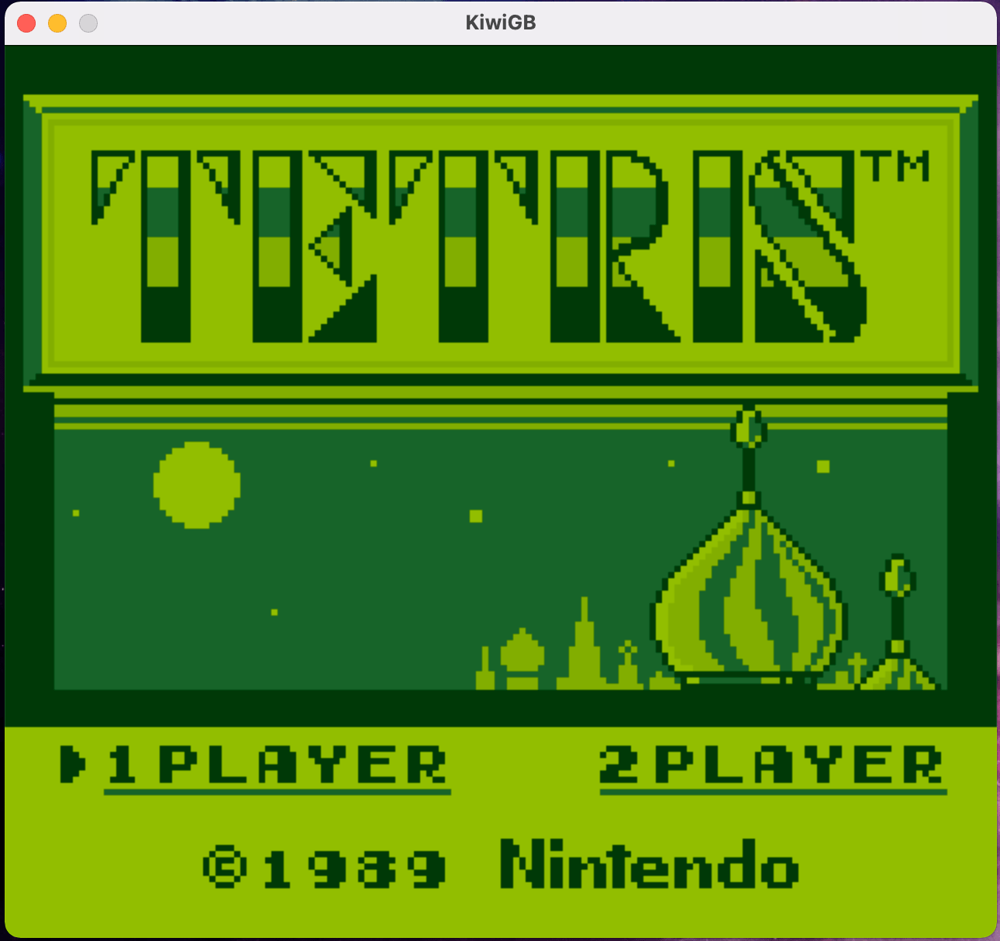
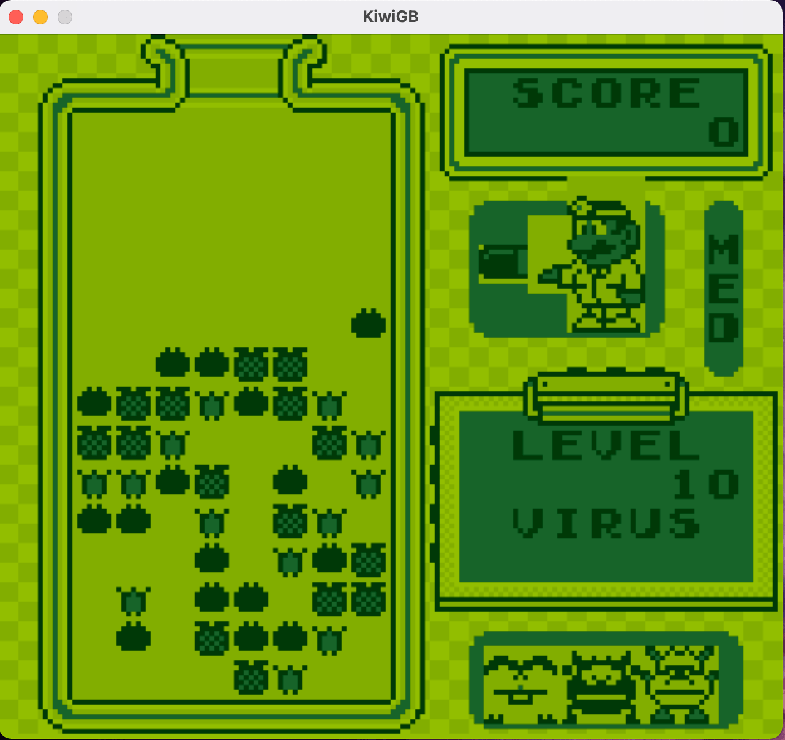

# 🥝 KiwiGB

A low-level gameboy emulator written in rust and SDL2.





Forked and restructured from https://github.com/Miliox/kiwi using unsafe.

## Dependencies

```
# macOS
brew install sdl2 sdl2_ttf
```

## Test Room

- [x] BIOS
- [ ] Tetris    (Kind Playable)
- [ ] Dr. Mario (Kind Playable)
- [ ] Alleway   (Sprite Mess)

### Blargg GB

- [x] 01-special
- [x] 02-interrupt
- [x] 03-op sp,hl
- [ ] 04-op r,imm
- [x] 05-op rp
- [x] 06-ld r,r
- [x] 07-jr,jp,call,ret,rst
- [x] 08-misc instrs
- [ ] 09-op r,r
- [x] 10-bit ops
- [ ] 11-op a,{hl}